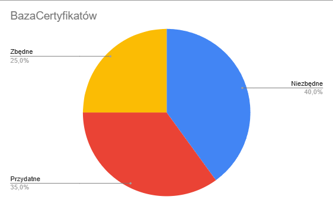

# 🤿 PlanDive 🤿

## Zespół:
* 💧**Jakub Wołczyński** - Team Leader
* 💧**Maja Lamch** - Analityk/Developer
* 💧**Paweł Bączek** - Analityk/Developer

## Wizja systemu

PlanDive to aplikacja webowa wspierająca organizację kursów nurkowania.  
System umożliwia zarządzanie harmonogramem zajęć, instruktorami oraz kursantami.

Aplikacja pozwala:
- zapisywać kursantów na zajęcia,
- przypisywać instruktorów zgodnie z kwalifikacjami,
- zarządzać harmonogramem (basen, jezioro),
- informować o zmianach i odwołaniach zajęć.

## Dlaczego ten system?

Obecnie szkoły nurkowania korzystają z:
- Excela
- telefonów
- e-maili

Powoduje to:
- chaos organizacyjny
- błędy w planowaniu
- brak aktualnych informacji

PlanDive rozwiązuje te problemy poprzez centralny system zarządzania.
# Część 1
## Ankiety potrzeb użytkownika

### Ankieta: https://forms.gle/jVBPXQEry4BEAxrD7

Na podstawie zebranych 20 odpowiedzi od grupy docelowej (właściciele szkół, instruktorzy, kursanci), wyciągnęliśmy następujące wnioski dla systemu PlanDive:

### Kluczowe statystyki:
* **Priorytet funkcji:** Większość badanych uznało **Kalendarz online** za funkcję niezbędną.
* **Największy problem:** Najczęściej zgłaszanym błędem był **chaos w komunikacji** (zmiany terminów podawane z opóźnieniem).
* **Decyzja projektowa:** Mimo sprzecznych opinii, zdecydowano o wprowadzeniu blokady zapisu dla osób bez badań lekarskich (wymóg bezpieczeństwa zgłoszony przez właścicieli).

### Tabela oraz wykresy

* ### Tabela odpowiedzi

* ### Wyniki dla: Kalendarz

* ### Wyniki dla: SMS 

* ### Wyniki dla: Baza Certyfikatów

* ### Wyniki dla: Rezerwacja Sprzętu

* ### Wyniki dla: Blokada wpisu bez ważnych badań lekarskich

## Podsumowanie części 1
Na podstawie zebranych wymagań użytkowników stworzono historyjki uzytkowników oraz kryteria akceptacji. Histroyjki użytkowników znajdują sie w folderze `documents` w postaci graficznej utworzene w Miro natomiast kryteria akceptacji znajdują się w tym samym folderze w pliku `KryteriaAkceptacji.md`.

# Część 2

W tej części projektu zajęliśmy się rozszerzeniem kryteriów akceptacji oraz utworzeniem scenariuszy testowych w formacie GWT (Given–When–Then). Opracowane zostały również diagramy aktywności oraz ich wizualizacje w postaci interaktywnego prototypu interfejsu w wersji low-fi.

## Kryteria akceptacji i scenariusze testowe

Kryteria akceptacji oraz scenariusze testowe znajdują się w folderze `documents`.

## Diagramy aktywności

Diagramy aktywności znajdują się w folderze `documents/Diagramy`. Obejmują one następujące procesy:

- dodawanie instruktora do kursu przez administratora,
- zapis kursanta na wybrany kurs ze sprawdzaniem ważności badań lekarskich,
- system powiadamiania o zmianie miejsca oraz daty zajęć spowodowanej warunkami pogodowymi.

## Interaktywny prototyp interfejsu

Prototyp interfejsu w wersji low-fi znajduje się w folderze `documents`. Obejmuje on:

- logowanie użytkownika jako administrator, instruktor lub kursant,
- przełączanie pomiędzy zakładkami (np. Logowanie -> Kursy -> Kalendarz -> Dokumenty),
- formularz zapisu na kursy.

## Podsumowanie części 2
Na podstawie rozszerzonych kryteriów akceptacji opracowano scenariusze testowe w formacie GWT (Given–When–Then), które umożliwiają weryfikację poprawności działania systemu. Dodatkowo przygotowano diagramy aktywności opisujące kluczowe procesy biznesowe oraz interaktywny prototyp interfejsu w wersji low-fi, pozwalający na zapoznanie się z podstawową nawigacją i funkcjonalnością aplikacji. Wszystkie materiały zostały umieszczone w folderze `documents`.